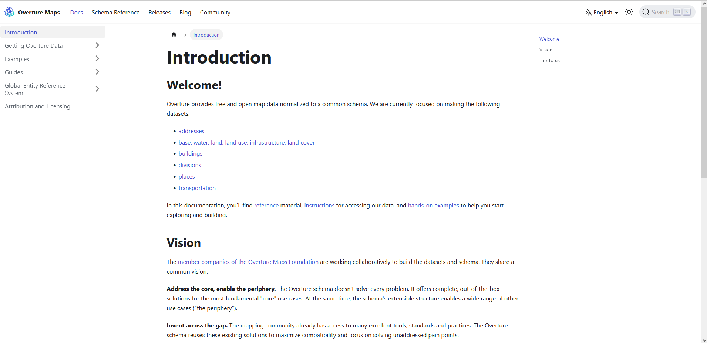
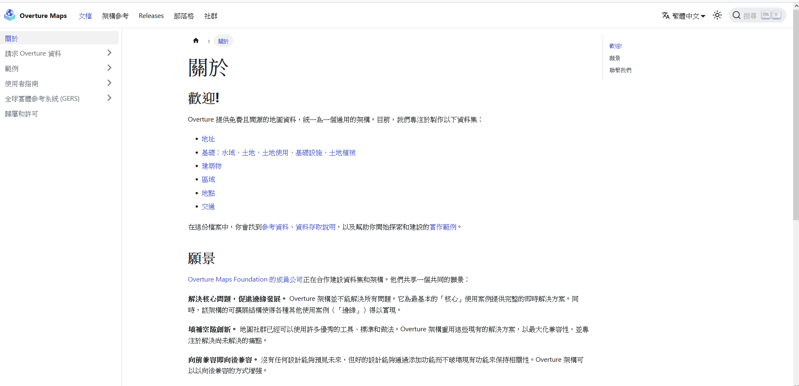

# Overture Documentation
[](./static/README/README_zh.md)

This repository uses [Docusaurus](https://docusaurus.io/) to publish the documentation pages seen at [docs.overturemaps.org](https://docs.overturemaps.org)

### Structure
- `blog/`: Entries for the Overture engineering blog available at docs.overturemaps.org/blog
- `community/`: The community page that showcases Overture data being used in the wild.
- `docs/`: The main documentation pages available at docs.overturemaps.org/. The sidebar for these pages is manually curated in the `sidebars.js` file.
- `release-blog/`: Release notes for every Overture data release. The latest release is always available at https://docs.overturemaps.org/release/latest/
- `i18n`: Location of translation files for various languages. Currently includes Traditional Chinese. For generating files in other languages, please refer to the [Docusaurus documentation](https://github.com/facebook/docusaurus).
- Notice there is no `schema reference` folder. See below.


###  Schema Reference (`docs.overturemaps.org/schema`)
The Overture schema repository [github/overturemaps/schema](https://github.com/overturemaps/schema) maintains the official Overture schema and the documentation surrounding the actual schema reference pages. This is to ensure that the schema, documentation, and relevant examples are always in-sync.

The script `fetch_schema.sh` injects the contents of the schema's documentation into `docs/schema/` and copies the schema `YAMl` files and examples to `docs/_schema` and `docs/_examples`, respectively. This script runs with every build.

Therefore, anything available at `docs.overturemaps.org/schema` (under the **Schema Reference** link in the header) comes from the Overture schema repository, not this repository. Any changes to `schema` will be overwritten on every build.


## Developing
Docusaurus requires node.
First, install the required packages:
```
$ npm install
```

Then, start the local server:
```
$ npm run start
```

Now navigate to http://localhost:3000 to see the live preview.

## demo


